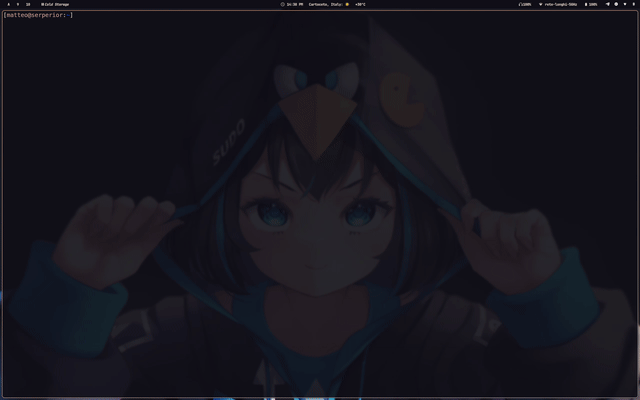

# Toolbox

> personal tools for writing code and do sysadmin and devops stuff :)



## Goals

The main objective is to have a simple, quick and efficient mini dev-environment that can run on a pletora of different systems without reling on some complex dependencies

## Features

The toolbox consists on a minimal vim configuration and some useful bash scripts

- `toolmux.sh` open project directory in a tmux session where panes and windows are created based on a config file `.tmux.conf` placed in the project directory (tmuxify style)
- `notify.sh` execute command and send notification trough [ntfy](https://ntfy.sh/), useful for long running processes

Vim and neovim are configured with some default integration like fzf and lazygit for file management and git operations, basic `ftplugin` for some devops tools and languages (`terraform`, `python`, `bash`, `yaml` and others),

## Installation

Toolbox support 2 installation procedures native (recommended) and as a docker container

### Native installation

Native installation can be performed in an archlinux box as follows

```bash
git clone https://github.com/carnivuth/toolbox
cd toolbox
./toolbox.sh
```

To uninstall run:

```bash
cd toolbox
./toolbox.sh uninstall
```

### Docker environment

Toolbox can be installed also with docker, this is useful to tryout the repository and it's functionalities, execute the following command inside a project directory

```bash
docker run --rm -u $UID:$UID -v "$(pwd)"/:/home/toolbox/"$(basename "$(pwd)")" --name toolbox -it carnivuth/toolbox /home/toolbox/.local/bin/toolmux.sh "/home/toolbox/$(basename "$(pwd)")"
```

This command will download the docker image and run the container with the current working directory mounted

### Install only `vimrc`

It's possible to install only the vimrc file for minimal configs and quick editing on remote machines, curl the lates release and put it in the `.vimrc` file

```bash
VERSION=1.0.1
cp $HOME/.vimrc $HOME/.vimrc.bak; curl -Ls https://github.com/carnivuth/toolbox/releases/download/vimrc-v$VERSION/vimrc > $HOME/.vimrc
```

To install on remote environment as application probes with ansible:

```yaml
---
- name: Install toolbox vimrc
  hosts: all
  vars:
    # change this for different versions
    version: 1.0.1
  tasks:
    - name: Ensure vim is installed
      become: true
      ansible.builtin.apt:
        - name: vim
        - state: present

    - name: Download vimrcfile
      ansible.builtin.get_url:
        url: https://github.com/carnivuth/toolbox/releases/download/vimrc-v{{ version }}/vimrc
        dest: ~/.vimrc
        # avoid deleting already present vimrc files
        backup: true
```
