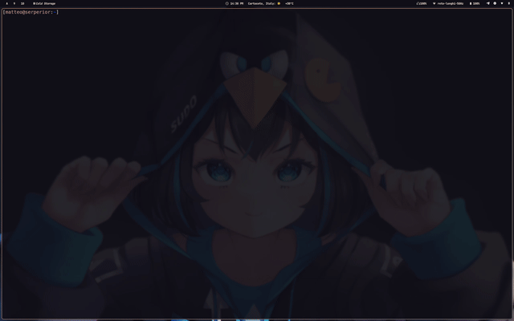

# Toolbox

> personal tools for writing code and do sysadmin and devops stuff :)



## Features

The main objective is to have a simple, quick and efficient mini dev-environment that can run on an archlinux box. The repo consists of

- neovim configuration with some default plugins (for a complete list of plugins check the [plugins directory](./etc/nvim/lua/plugins))
- vim configuration as backup
- [tmux](https://github.com/tmux/tmux/wiki) configuration
- [starship](https://starship.rs/) configuration

- [`toolmux.sh`](./bin/toolmux.sh) which is a script to open a tmux session inside a given directory where panes and windows are created based on a config file `.tmux.conf` placed in the project directory (tmuxify style) this also to simulate the `code` command

```bash
# instead of
code my-project
# i run
toolmux.sh my-project
# there is also an alias
tmx my-project
```

- [`sync.sh`](./bin/sync.sh) which is a script to perform sync operations of the given directory to a set of remote vms at each file change, useful to test the project on remote environments without manually syncing file projects it also mimics the workflow with `vscode` and sshfs extension

### installation

Installation can be performed in an archlinux box as follows

- ensure sudo is configured to run `pacman` without password

> [!NOTE]
> this is required also for the updating
```bash
echo "$USER ALL=(ALL:ALL) NOPASSWD:/bin/pacman" | sudo tee "/etc/sudoers.d/$USER"
```

- then run the make target

```bash
git clone https://github.com/carnivuth/toolbox
cd toolbox
make install # this one will require the use of sudo to install dependencies
```

### Run as a Docker container

Toolbox can be installed also with docker, this is useful to tryout the repository and it's functionalities without touching your box, execute the following command inside a project directory

```bash
docker run --rm -u $UID:$UID -v "$(pwd)"/:/home/toolbox/"$(basename "$(pwd)")" --name toolbox -it carnivuth/toolbox /home/toolbox/.local/bin/toolmux.sh "/home/toolbox/$(basename "$(pwd)")"
```

This command will download the docker image and run the container with the current working directory mounted

### Install only `vimrc`

It's possible to install only the vimrc file for minimal configs and quick editing on remote machines, curl the lates release and put it in the `.vimrc` file

```bash
VERSION=1.0.1
cp $HOME/.vimrc $HOME/.vimrc.bak; curl -Ls https://github.com/carnivuth/toolbox/releases/download/vimrc-v$VERSION/vimrc > $HOME/.vimrc
```

To install on remote environment as application probes with ansible:

```yaml
---
- name: Install toolbox vimrc
  hosts: all
  vars:
    # change this for different versions
    version: 1.0.1
  tasks:
    - name: Ensure vim is installed
      become: true
      ansible.builtin.apt:
        - name: vim
        - state: present

    - name: Download vimrcfile
      ansible.builtin.get_url:
        url: https://github.com/carnivuth/toolbox/releases/download/vimrc-v{{ version }}/vimrc
        dest: ~/.vimrc
        # avoid deleting already present vimrc files
        backup: true
```

### Updating

The `install` make target creates a git hook that on pull will trigger the installation procedure, for this to work pacman needs to be executed without password

```bash
echo "$USER ALL=(ALL:ALL) NOPASSWD:/bin/pacman" | sudo tee "/etc/sudoers.d/$USER"
```

### Uninstall toolbox

To uninstall run:

> [!WARNING]
> this will leave packages installed as dependencies
```bash
cd toolbox
make clean
```
